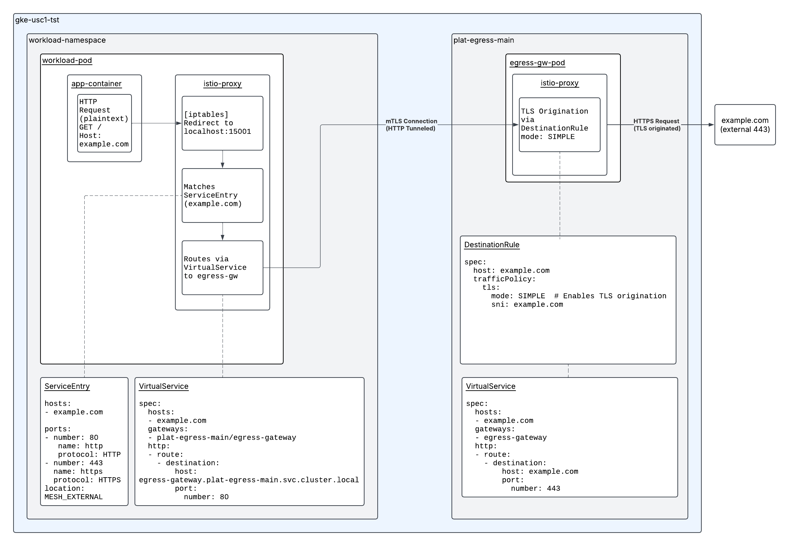

# Istio Egress Gateway Proof of Concept

This repository contains a proof of concept (PoC) demonstrating how to configure an Istio service mesh to handle outbound HTTP traffic from a workload, route it through an egress gateway, and secure it with mutual TLS (mTLS) using SPIFFE identities. The setup includes namespaces, deployments, Istio configurations, and optional sidecar restrictions to enforce traffic routing through the service mesh.



## Overview

The PoC originates an HTTP call from a source workload pod in the `curl-external-tst` namespace, which is intercepted by the Istio sidecar proxy (Envoy). The traffic is then routed through an egress gateway in the `curl-egress-tst` namespace, where it is encrypted with mTLS, forwarded to an external service (`jsonplaceholder.typicode.com`), and processed. The configuration ensures secure communication and controlled egress traffic using Istio’s service mesh capabilities.

### Key Components

- **Namespaces**: Two namespaces (`curl-external-tst` for the workload, `curl-egress-tst` for the egress gateway).
- **Workload**: A `curl-test` deployment that generates HTTP requests to `jsonplaceholder.typicode.com`.
- **Egress Gateway**: A dedicated gateway deployment (`curl-egress-tst-gateway`) to handle outbound traffic.
- **Istio Configurations**: `ServiceEntry`, `VirtualService`, `DestinationRule`, `Gateway`, and an optional `Sidecar` resource to enforce mesh routing.
- **Authorization**: An `AuthorizationPolicy` to allow traffic from the workload namespace to the egress gateway.

## Resource Interactions

1. **Source Workload (`deployment-workload.yaml`)**:
   - A `curl-test` pod in the `curl-external-tst` namespace runs a container that continuously sends HTTP requests to `http://jsonplaceholder.typicode.com/todos/1`.
   - The pod is injected with an Istio sidecar proxy (`istio-proxy`) due to the `sidecar.istio.io/inject: "true"` annotation.

2. **Istio Sidecar Proxy (Source)**:
   - The sidecar intercepts the outbound HTTP request from the `curl-test` container.
   - Based on the `VirtualService` (`virtualservice-workload.yaml`), the traffic is redirected to the egress gateway service (`curl-egress-tst.curl-egress-tst.svc.cluster.local`) on port 80.
   - The `ServiceEntry` (`serviceentry.yaml`) defines the external host (`jsonplaceholder.typicode.com`) as part of the mesh, allowing Istio to manage it.
   - The sidecar encrypts the HTTP payload into a TCP stream using mTLS with SPIFFE identities and forwards it to the egress gateway.

3. **Egress Gateway (`deployment-egress-gw.yaml`)**:
   - The egress gateway deployment (`curl-egress-tst-gateway`) in the `curl-egress-tst` namespace receives the encrypted TCP stream.
   - The gateway’s Istio proxy decrypts the mTLS stream, inspects the original HTTP request, and applies Envoy filters.
   - The `Gateway` (`gateway.yaml`) and `VirtualService` (`virtualservice-egress-gw.yaml`) configure the gateway to forward the request to `jsonplaceholder.typicode.com` on port 443 with TLS origination (defined in `destintionrule.yaml`).

4. **TLS Origination (`destintionrule.yaml`)**:
   - The `DestinationRule` specifies TLS mode as `SIMPLE` with SNI set to `jsonplaceholder.typicode.com`, ensuring the egress gateway originates TLS to the external service.

5. **Authorization (`authorization-policy.yaml`)**:
   - An `AuthorizationPolicy` allows traffic from the `curl-external-tst` namespace to reach the egress gateway, ensuring secure and controlled communication.

## Traffic Flow and Encryption

- **Source Sidecar Behavior**:
  - The HTTP request originates from the `curl-test` container as plain HTTP on port 80.
  - The Istio sidecar intercepts this request, applies outbound routing rules from the `VirtualService` and `ServiceEntry`, and encrypts the entire HTTP payload into a TCP stream using mTLS.
  - The encrypted stream is sent to the egress gateway over the wire.
  - **Note**: The source sidecar does not generate HTTP-specific metrics (e.g., request counts, latencies) because Envoy filters are not applied to mTLS-encrypted outbound streams. It simply forwards the encrypted TCP stream.

- **Egress Gateway Behavior**:
  - The egress gateway’s Istio proxy receives the mTLS-encrypted TCP stream, decrypts it, and reconstructs the original HTTP request.
  - Envoy filters are applied at this point, enabling HTTP metrics (e.g., request rates, response codes) to be emitted by the gateway.
  - The gateway then originates a new TLS connection to `jsonplaceholder.typicode.com` and forwards the HTTP request.

In summary:
- The source sidecar encrypts the HTTP payload as a TCP stream.
- The egress gateway decrypts, inspects, and emits HTTP metrics before forwarding the request externally.

## Optional `sidecar.yaml`

The `sidecar.yaml` file defines a `Sidecar` resource in the `curl-external-tst` namespace with the following configuration:
```yaml
spec:
  outboundTrafficPolicy:
    mode: REGISTRY_ONLY
  workloadSelector:
    labels:
      app: curl-test